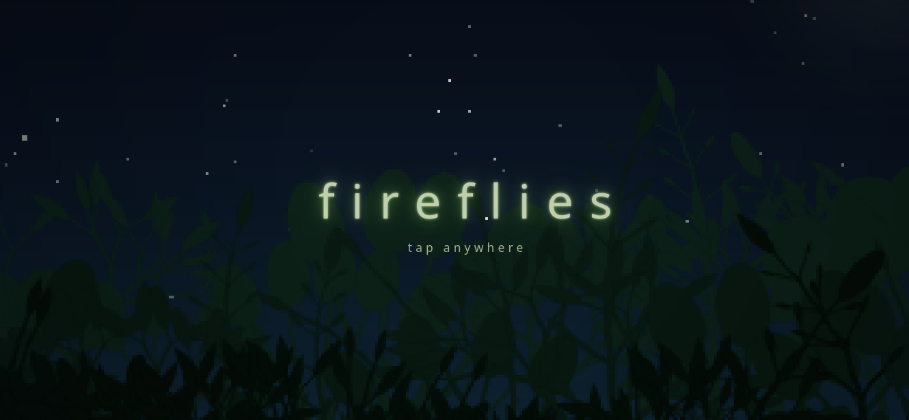

# fireflies

A tiny firefly simulation for the browser. Tap anywhere to add fireflies, then
watch them wander over the grass and slowly blink in time with each other.

### ▶ [jakobkreft.github.io/fireflies](https://jakobkreft.github.io/fireflies)

Two algorithms drive it:

- Flight: steering behaviours (Reynolds' boids), a restless wander with a light
  touch of flocking.
- Blinking: pulse-coupled oscillators (Mirollo & Strogatz) plus slow frequency
  entrainment (Kuramoto), so the swarm drifts into sync on its own.

The plants are grown with L-systems, and the whole scene is rendered at low
resolution and scaled up for the pixel-art look. Tap the ? for more.

No build step and no dependencies. Open `index.html`, or host the folder
anywhere static.
